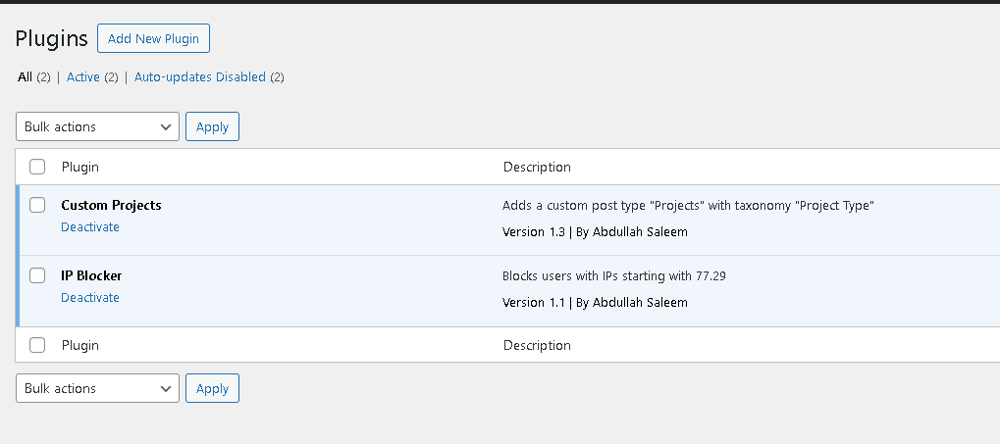
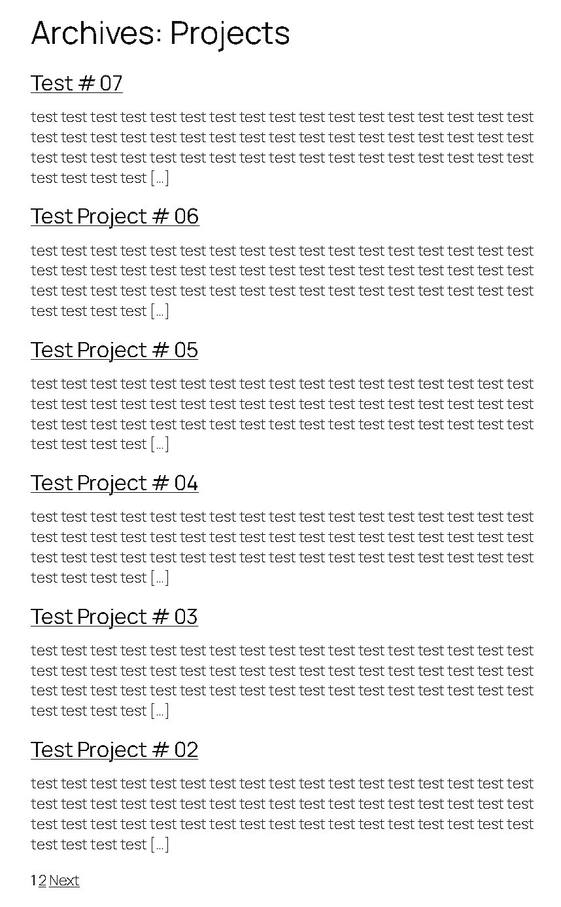
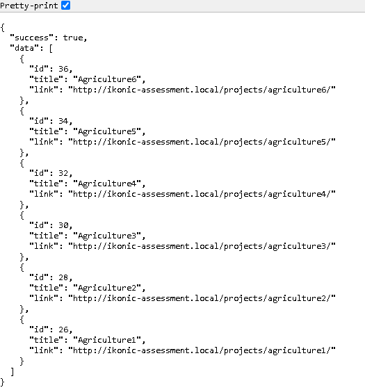
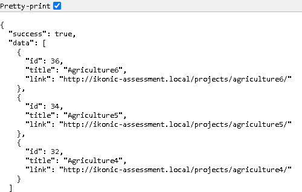
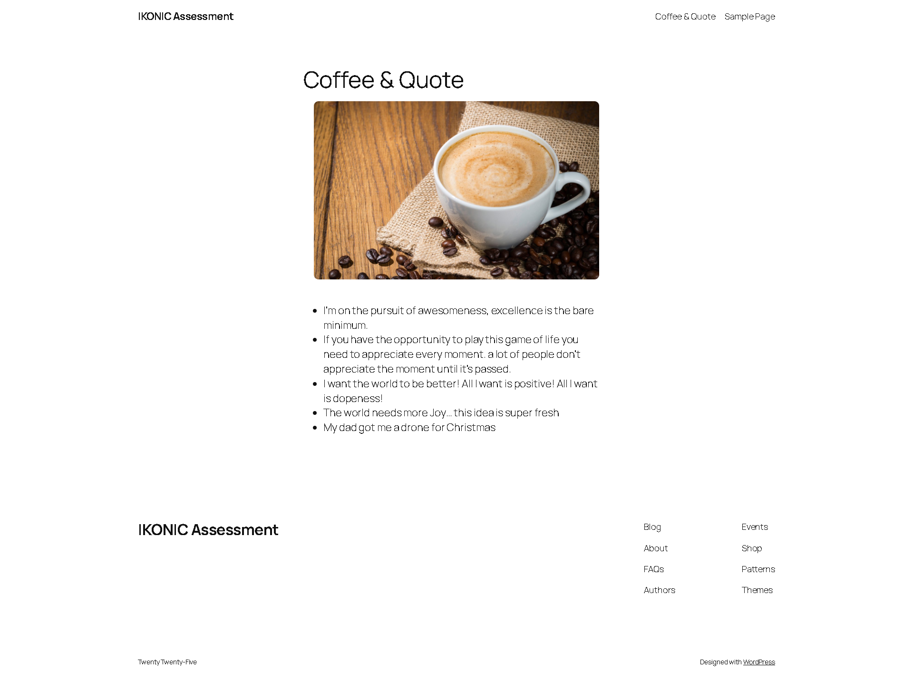

**WordPress Backend Developer Assessment Submission**

**Introduction**

This document outlines the completion of the assigned assessment task for the WordPress Backend Developer position at IKONIC DEV. Below, you will find details on each implemented feature along with relevant file paths and links.

1.  **Repository Link**

As instructed, the initial commit of the blank WordPress project has been made, pushing only the wp-content/plugins and wp-content/themes folders.

**GitHub Repository:** <https://github.com/AbdullaRao/ikonic-assessment>

**2. User IP Blocking Functionality**

A function was implemented to redirect users whose IP addresses start with 77.29. This was achieved using WordPress hooks and APIs.

**File Path:** wp-content/plugins/ip-blocker/ip-blocker.php

**Figure 1: Custom Plugins Listed**

To test its functionality, modify the IP address in the code accordingly.

**3. Custom Post Type & Taxonomy Registration**

The "Projects" post type and "Project Type" taxonomy were registered to categorize project entries appropriately.

**File Path:** wp-content/plugins/custom-post-types/projects.php

This ensures that project entries can be created and categorized effectively.

**4. Archive Page for Projects**

A custom archive page was developed to display six "Projects" per page with pagination (Next/Prev buttons). The necessary updates were made in both the plugin and the functions.php file of the active theme to enable this functionality.

**File Path:** wp-content/themes/your-theme/archive-projects.php

This ensures that projects are listed dynamically with a structured layout and pagination support.

**5. AJAX Endpoint for Filtering Projects**

An AJAX endpoint was created to return published "Projects" under the "Architecture" category. The response varies based on user authentication:

-   Non-logged-in users receive the last 3 projects.
-   Logged-in users receive the last 6 projects.

**File Path:** http://ikonic-assessment.local/wp-admin/admin-ajax.php?action=hs_get_projects

The results are returned in JSON format:

**Figure 3: JSON Output for logged In User**

Figure 4: JSON Output for logged Out User

**6. Coffee API Integration (Coffee & Quote Page)**

A function hs_give_me_coffee() was created using the WordPress HTTP API to fetch and return a direct link to a random cup of coffee and is implemented in the functions.php of the active theme and created a Short-code [coffee_quotes] used on the page.

**File Path:** wp-content/themes/twentytwentyfive/function.php

http://ikonic-assessment.local/coffee-quote/

This ensures seamless API integration to fetch and display coffee images dynamically.

**7. Quote (Coffee & Quote Page)**

A dedicated page was created to display five quotes fetched from the https://api.kanye.rest/ API. This page is accessible via the link below and is implemented in the functions.php of the active theme and created a Short-code [coffee_quotes] used on the page.

**File Path:** wp-content/themes/twentytwentyfive/function.php

http://ikonic-assessment.local/coffee-quote/

This page successfully retrieves and displays real-time quotes.

All required functionalities have been implemented and tested successfully. Please review the provided links and file paths, and let me know if further clarifications are needed.

Thanks again for the opportunity!

**\~\~END\~\~**
